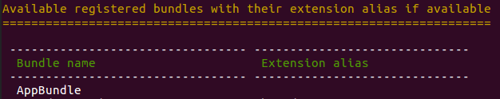

How to create a new bundle
==========================

Creating a new bundle in Open Loyalty is as simple as creating a new bundle in Symfony Framework.
If you’re not familiar with bundles architecture, check this great article
`Symfony documentation <https://symfony.com/doc/3.4/bundles.html>`_.

Nevertheless, let’s see how to do that in our loyalty program.

Let’s create a single AppBundle that will contain our all logic. This bundle will be used with other receipts
from this cookbook so it’s worth to do it and stick with the convention. It will help you to understand the basics.

First of all, create a new directory in the src ``AppBundle`` and then create a class named AppBundle

.. code-block:: php

    // src/AppBundle/AppBundle.php
    namespace AppBundle;

    use Symfony\Component\HttpKernel\Bundle\Bundle;

    class AppBundle extends Bundle
    {
    }

Then you need to register newly created bundle in the framework.

.. code-block:: php

    // app/AppKernel.php
    public function registerBundles()
    {
        $bundles = array(
            // ...

            // register your bundle
            new AppBundle\AcmeTestBundle(),
        );
        // ...

        return $bundles;
    }

Let’s verify that bundle has been registered properly. I assume you use Docker.

.. code-block:: bash

    $ docker exec -it --user=www-data open_loyalty_backend bin/console debug:config

At the top of the table, you should see our AppBundle

