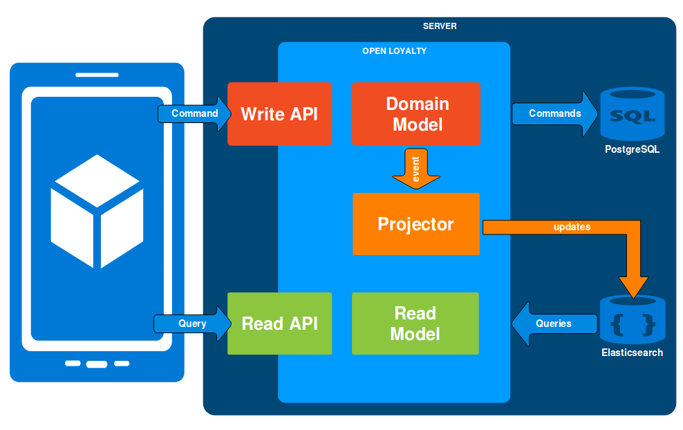

CQRS
====

CQRS stands for Command Query Responsibility Segregation. It's a pattern that was described by Greg Young. At its
heart is the notion that you can use a different model to update information than the model you use to read
information.

