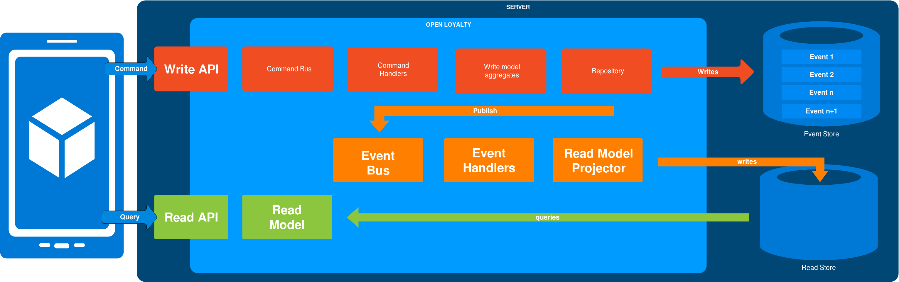

Event Sourcing
==============

Event Sourcing ensures that all changes to application state are stored as a sequence of events. Not just can we
query these events, we can also use the event log to reconstruct past states, and as a foundation to automatically
adjust the state to cope with retroactive changes.

To implement event sourcing we use an external library called `Broadway <https://github.com/broadway/broadway>`_.

No everything in Open Loyalty is event sourced. And that’s fine.
