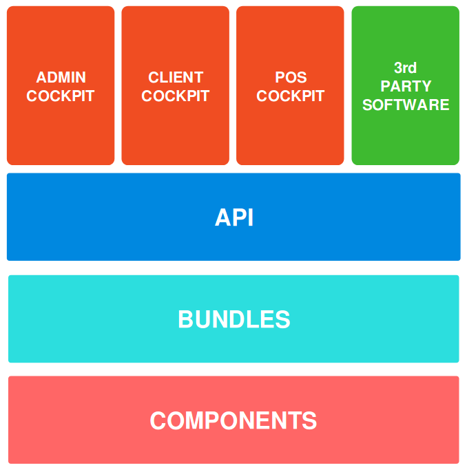

Overview
========

Fullstack Symfony
-----------------

Open Loyalty is based on Symfony, which is a leading PHP framework to create web applications. Using Symfony
allows developers to work better and faster by providing them with certainty of developing an application that
is fully compatible with the business rules, that is structured, maintainable and upgradable, but also it allows
to save time by providing generic re-usable modules.

Doctrine
--------

Doctrine is a family of PHP libraries focused on providing data persistence layer. The most important are the
object-relational mapper (ORM) and the database abstraction layer (DBAL). One of Doctrine’s key features is the
possibility to write database queries in Doctrine Query Language (DQL) - an object-oriented dialect of SQL.

To learn more about Doctrine - see their documentation.

Boradway
--------

Broadway is a project providing infrastructure and testing helpers for creating CQRS and event sourced applications.
Broadway tries hard to not get in your way. The project contains several loosely coupled components that can be used
together to provide a full CQRS\ES experience.

To find more about Broadway see `their documentation <https://broadway.github.io/broadway/>_`.

Architecture
============

Admin cockpit
-------------
The frontend application that allows an administrator to manage the loyalty application.

Client cockpit
--------------
A frontend application for end customers. It allows customers to check their profile, points, transactions history
and redeem reward.

POS Cockpit
POS stands for Point-of-sale. It’s a physical store where you can buy stuff. This cockpit is a user interface for
merchants to register a customer in loyalty program or spend points to reduce purchase amount.

3rd party software
Thanks to the separation between frontend and backend any third party software can integrate with Open Loyalty and
benefit from it. You can even replace existing cockpits with your own solution like mobile application for end customers.

API
---
Our API uses the REST approach.

Bundles
-------
It’s a place where a business logic from the components is integrated with used Symfony Framework. By separating
business logic from the framework, it’s easily to focus and maintain business aspects of the application and the
integration with framework.

Components
----------
It’s a heart of our software. Here lies are business rules of the loyalty program. Components have been created
with Domain Driven Design in mind. So if you’re familiar with this concept you can find here know to you patterns
like domain models and infrastructure objects.
